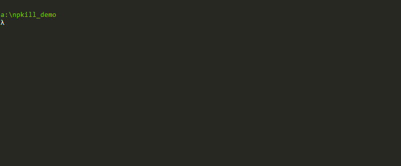

<p align="center">
  
</p>
<p align="center">


</p>

### Easily find and remove old and heavy <font color="red">node_modules</font> folders :sparkles:

<p align="center">
  
</p>

## Table of Contents

- [Installation](#installation)
- [Usage](#usage)
- [Contributing](#contributing)

## Installation

```bash
$ npm i -g npkill
```

(Some unix users may need to run the command with sudo)

## Usage

```bash
npkill
```

Use <kbd>↑</kbd> and <kbd>↓</kbd> keys to select the folder, and press <kbd>Supr</kbd> key to delete. 

### Options

| ARGUMENT          | DESCRIPTION                                                                                                                     |
| ----------------- | ------------------------------------------------------------------------------------------------------------------------------- |
| -h, --help, ?     | Shows a help page, with all options                                                                                             |
| -r, --root        | Set the root directory from which to start searching. By default, the root is the directory from which this command is executed |
| -f, --full        | Start searching from the home of the user (example: "home/user" in linux).,                                                     |
| -D, --delete-all  | Automatically delete all node_modules folders that are found                                                                    |
| -e, --show-errors | It shows a brief error message in the lower part incase one occurred                                                            |

### Examples
- Find all node_modules contained in a directory named *projects*.
```bash
npkill  --root ~/projects/
```
or
```bash
cd ~/projects/
npkill
```

- Clear all node_modules that for some reason managed to sneak into any of your backups.
```bash
npkill  --root ~/backups/ --delete-all
```

## Contributing
Available soon

---

## Donations
We developed Npkill in our free time because we wanted to create something useful for our peers. We honestly hope it has been of help :)

If you want, you can treat us to a cup of coffee (or a nice cold beer :p): 
- [Paypal (soon)](https://www.paypal.me/)

# Main devs
Available soon